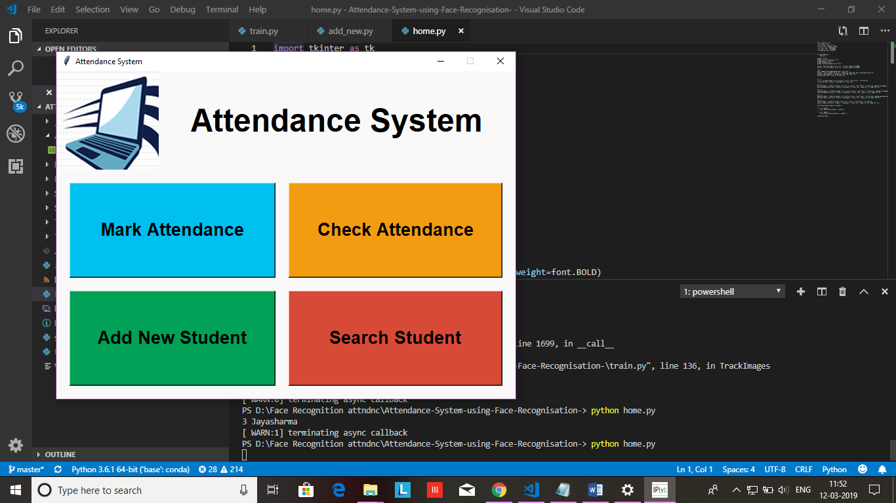

# FACE RECOGNITION
This repository contains code for Facial recognition using openCV and python with a tkinter GUI interface. If you want to test the code then run home.py file</p>
## Technology used : 
-openCV (Opensource Computer Vision) -Python -tkinter GUI interface
## How to setup Project
Use a command to setup the project
```
python setup.py build
```
## Instructions To Use Projects 
 When we run **home.py** a window is opened and ask for Add new student, Mark attendance, Check attendance and Search Student. Select Add new student button.
<p align="center">
  
</p>
 Another window will open and ask for Enter Id, Name and Department.
<p align="center">
  
</p>
 After enter name, id and department then we have to click on Take Images button. By clicking Take Images camera of running computer is opened and it start taking image sample of person.Press Q to click image.
<p align="center">
  
</p>
<p align="center">
  
</p>
This Id and Name is stored in folder StudentDetails and file name is StudentDetails.csv. It takes 60 images as sample and store them in folder TrainingImage. After completion it notify that iamges saved.
<p align="center">
  
</p>
After taking image sample it will Train Image.Now it take few seconds to train machine for the images that are taken by clicking Take Image button and creates a Trainner.yml file and store in TrainingImageLabel folder.
<p align="center">
  
</p>
 By clicking Mark Attendance button camera of running machine is opened again. If face is recognised by system then Id and Name of person is shown on Image.Press Q(or q) for quit this window.
 <p align="center">
  
</p>
<p align="center">
  
</p>
After quitting it attendance of person will be stored in Attendance folder as csv file with Name, Id, date and time and it is also available in window.
<p align="center">
  
</p>
<p align="center">
  
</p>
<p align="center">
  
</p>
<h2>References:</h2>
 <p>https://ieeexplore.ieee.org/document/6242980<p>
<p> https://ieeexplore.ieee.org/document/8285517<p>
 https://ieeexplore.ieee.org/document/7944103
